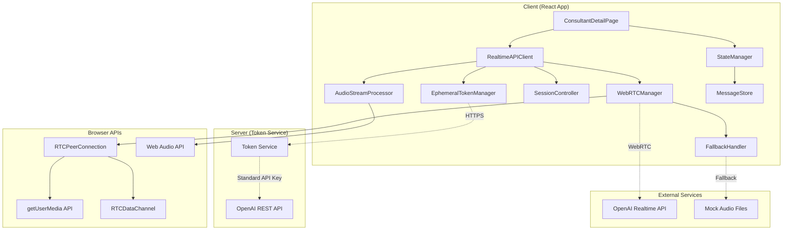
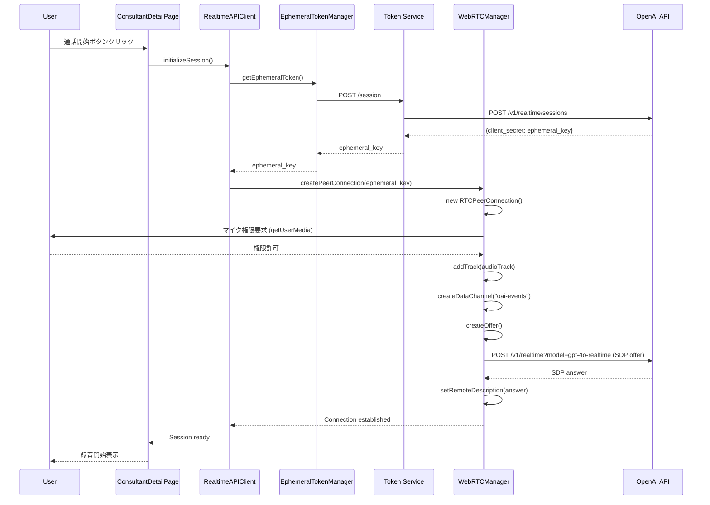
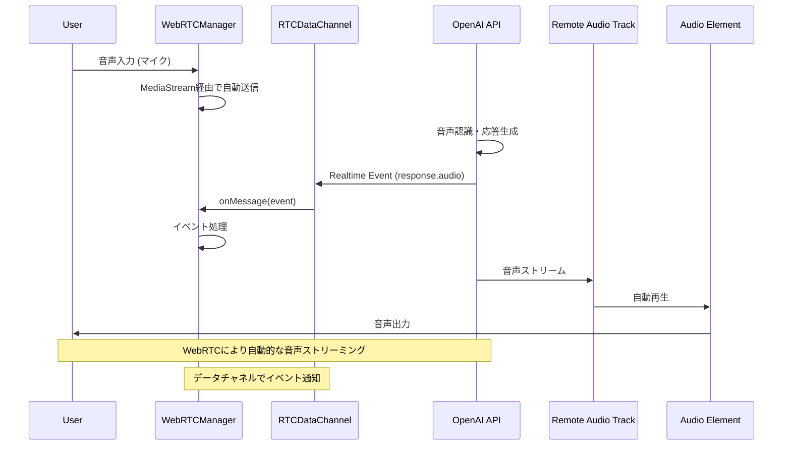
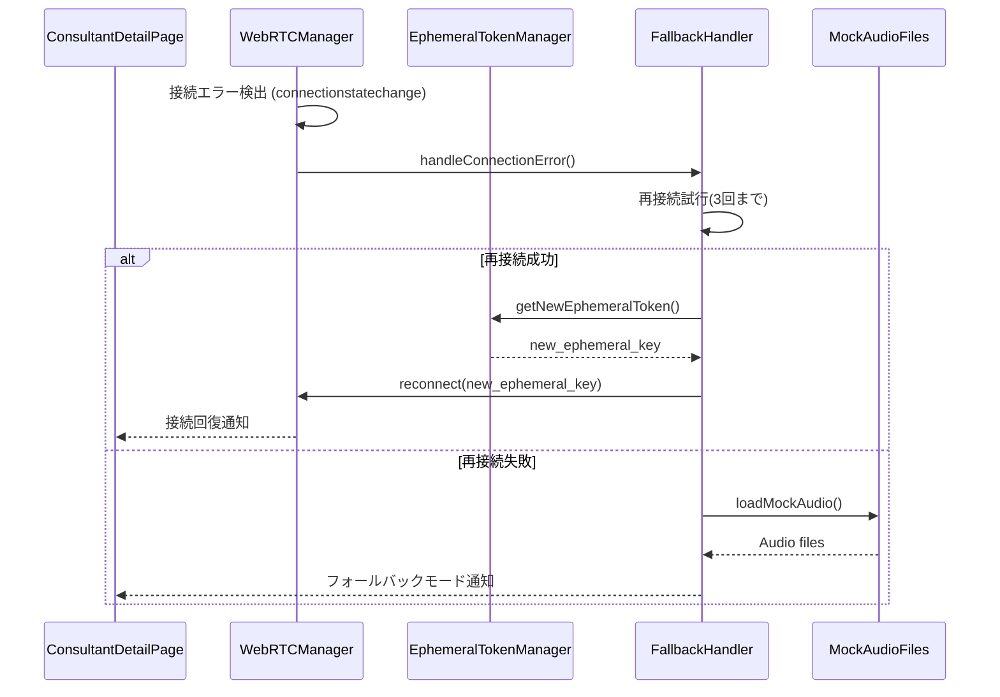
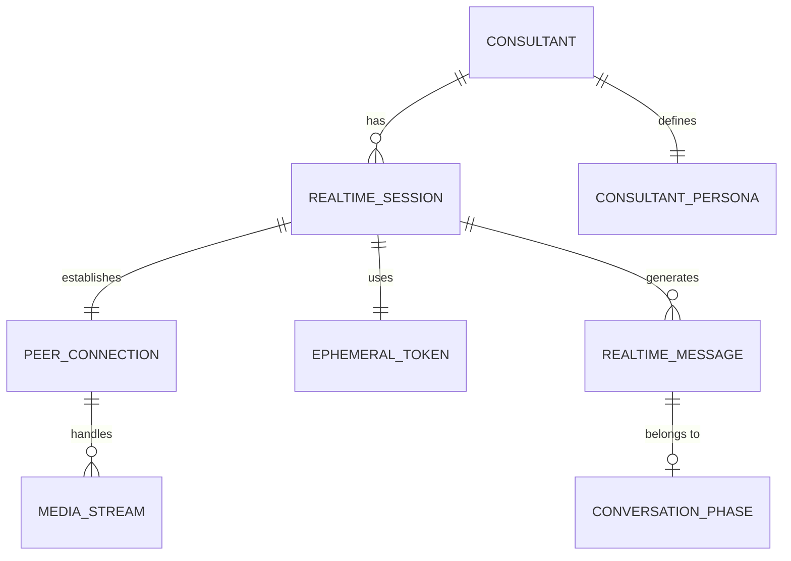
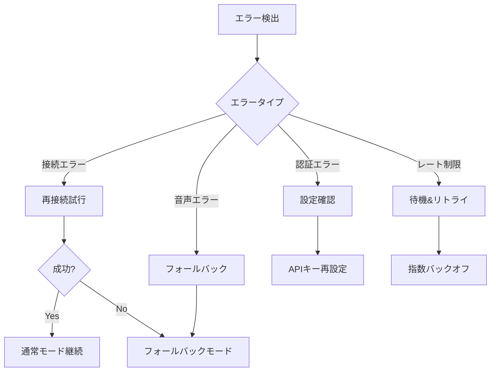
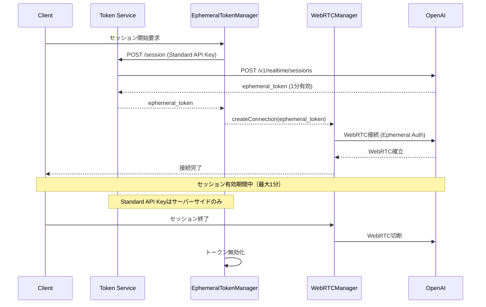
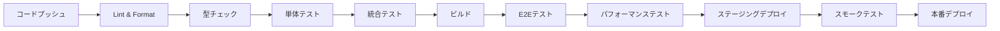

# 技術設計書

## 概要
既存のConsultantDetailPage.tsxで実装されているモック音声ファイル（001.wav～005.wav）を使用した対話システムを、OpenAI Realtime APIを活用したリアルタイム音声対話システムに置き換える。WebRTCベースのピアツーピア通信により、低遅延で自然な音声対話を実現し、コンサルタントのペルソナを維持しながら動的な応答生成を可能にする。

## 要件マッピング

### 設計コンポーネントのトレーサビリティ
各設計コンポーネントが対応する要件：
- **WebRTCManager** → REQ-2.2: WebRTC接続管理要件
- **AudioStreamProcessor** → REQ-2.1: 音声入出力要件
- **SessionController** → REQ-2.3: 会話管理要件
- **RealtimeAPIClient** → REQ-2.4: コンサルタントペルソナ要件
- **FallbackHandler** → REQ-2.5: エラー回復要件
- **EphemeralTokenManager** → REQ-4.1: 環境変数設定とセキュリティ要件
- **StateManager** → REQ-4.4: 状態管理の更新要件

### ユーザーストーリーカバレッジ
- ユーザーストーリー5.1（基本的な音声コンサルテーション）: AudioStreamProcessor + WebRTCManagerで実現
- ユーザーストーリー5.2（会話の中断と再開）: SessionControllerで制御
- ユーザーストーリー5.3（接続エラー時の対応）: FallbackHandlerで自動フォールバック
- ユーザーストーリー5.4（会話履歴の確認）: StateManagerでメッセージ履歴管理
- ユーザーストーリー5.5（モバイルでの利用）: レスポンシブUIとWebRTC対応

## アーキテクチャ

### システム全体構成



### 技術スタック

- **フロントエンド**: React 18.3.1 + TypeScript 5.5.3（既存）
- **WebRTC通信**: ネイティブWebRTC API (RTCPeerConnection)
- **音声処理**: WebRTC MediaStream + Web Audio API
- **データチャネル**: RTCDataChannel (イベント送受信)
- **状態管理**: React Hooks (useState, useReducer, useContext)
- **認証**: Ephemeral Token方式 (1分間有効)
- **音声フォーマット**: WebRTC標準音声フォーマット
- **エラーハンドリング**: カスタムエラーバウンダリ + フォールバック機構
- **環境変数管理**: Vite環境変数システム

### アーキテクチャ決定の根拠

- **WebRTC選択理由**: クライアントサイド推奨方式、低遅延、NAT/ファイアウォール対応
- **Ephemeral Token選択理由**: セキュリティ向上、標準APIキーをクライアントに露出させない
- **RTCDataChannel選択理由**: リアルタイムイベント送受信、WebRTCと統合された通信
- **Web Audio API選択理由**: ブラウザネイティブで高性能な音声処理が可能
- **React Hooks選択理由**: 既存コードベースとの一貫性を保ち、学習コストを削減

## データフロー

### 主要ユーザーフロー

#### 1. 音声対話開始フロー (WebRTC - OpenAI公式準拠)



#### 2. リアルタイム音声処理フロー (WebRTC)



#### 3. エラー回復フロー (WebRTC)



## コンポーネントとインターフェース

### バックエンドサービス＆メソッドシグネチャ

#### RealtimeAPIClient クラス
```typescript
class RealtimeAPIClient {
  constructor(config: RealtimeConfig)
  
  // セッション管理
  async initializeSession(consultantId: string): Promise<Session>  // セッション初期化
  async terminateSession(): Promise<void>                          // セッション終了
  updateInstructions(persona: ConsultantPersona): void            // ペルソナ更新
  
  // 音声制御
  startListening(): void                                          // 音声入力開始
  stopListening(): void                                           // 音声入力停止
  pausePlayback(): void                                          // 再生一時停止
  resumePlayback(): void                                         // 再生再開
  
  // イベントハンドラ
  on(event: RealtimeEvent, handler: EventHandler): void          // イベント登録
  off(event: RealtimeEvent, handler: EventHandler): void         // イベント解除
}
```

#### WebRTCManager クラス (OpenAI公式実装ベース)
```typescript
class WebRTCManager {
  private peerConnection: RTCPeerConnection | null = null;
  private dataChannel: RTCDataChannel | null = null;
  private audioElement: HTMLAudioElement | null = null;
  
  constructor(config: WebRTCConfig) {}
  
  // 公式ドキュメントの init() 関数に基づく実装
  async init(ephemeralToken: string): Promise<void> {
    // Create a peer connection (公式例準拠)
    this.peerConnection = new RTCPeerConnection();

    // Set up to play remote audio from the model (公式例準拠)
    this.audioElement = document.createElement("audio");
    this.audioElement.autoplay = true;
    this.peerConnection.ontrack = e => this.audioElement!.srcObject = e.streams[0];

    // Add local audio track for microphone input (公式例準拠)
    const mediaStream = await navigator.mediaDevices.getUserMedia({
      audio: true
    });
    this.peerConnection.addTrack(mediaStream.getTracks()[0]);

    // Set up data channel for sending and receiving events (公式例準拠)
    this.dataChannel = this.peerConnection.createDataChannel("oai-events");
    this.dataChannel.addEventListener("message", (e) => {
      // Realtime server events appear here! (公式コメント準拠)
      this.handleRealtimeEvent(JSON.parse(e.data));
    });

    // Start the session using the Session Description Protocol (SDP) (公式例準拠)
    const offer = await this.peerConnection.createOffer();
    await this.peerConnection.setLocalDescription(offer);

    const baseUrl = "https://api.openai.com/v1/realtime";
    const model = "gpt-4o-realtime-preview-2025-06-03";
    const sdpResponse = await fetch(`${baseUrl}?model=${model}`, {
      method: "POST",
      body: offer.sdp,
      headers: {
        Authorization: `Bearer ${ephemeralToken}`,
        "Content-Type": "application/sdp"
      },
    });

    const answer = {
      type: "answer" as RTCSdpType,
      sdp: await sdpResponse.text(),
    };
    await this.peerConnection.setRemoteDescription(answer);
  }
  
  // イベント送信 (DataChannel経由)
  sendEvent(event: RealtimeEvent): void {
    if (this.dataChannel && this.dataChannel.readyState === 'open') {
      this.dataChannel.send(JSON.stringify(event));
    }
  }
  
  // 接続状態取得
  getConnectionState(): RTCPeerConnectionState | null {
    return this.peerConnection?.connectionState || null;
  }
  
  // リソース解放
  disconnect(): void {
    this.audioElement?.pause();
    this.dataChannel?.close();
    this.peerConnection?.close();
  }
  
  private handleRealtimeEvent(event: any): void {
    // Realtime APIイベントの処理
    console.log('Received Realtime event:', event);
  }
}
```

#### EphemeralTokenManager クラス (公式Token Service準拠)
```typescript
class EphemeralTokenManager {
  private currentToken: string | null = null;
  private tokenExpiry: Date | null = null;
  
  constructor(private tokenServiceUrl: string = "/session") {}
  
  // 公式ドキュメントのfetch("/session")パターンに基づく実装
  async getEphemeralToken(): Promise<string> {
    if (this.currentToken && !this.isTokenExpired()) {
      return this.currentToken;
    }

    // Get an ephemeral key from your server (公式コメント準拠)
    const tokenResponse = await fetch(this.tokenServiceUrl);
    const data = await tokenResponse.json();
    const ephemeralKey = data.client_secret.value;
    
    this.currentToken = ephemeralKey;
    // エフェメラルトークンは1分で期限切れ
    this.tokenExpiry = new Date(Date.now() + 60 * 1000);
    
    return ephemeralKey;
  }
  
  isTokenExpired(): boolean {
    if (!this.tokenExpiry) return true;
    return Date.now() >= this.tokenExpiry.getTime();
  }
  
  refreshToken(): Promise<string> {
    this.clearToken();
    return this.getEphemeralToken();
  }
  
  clearToken(): void {
    this.currentToken = null;
    this.tokenExpiry = null;
  }
}

// 対応するサーバーサイドの実装 (公式Node.js Express例準拠)
/*
import express from "express";

const app = express();

// 公式ドキュメントのサンプルコードそのまま
app.get("/session", async (req, res) => {
  const r = await fetch("https://api.openai.com/v1/realtime/sessions", {
    method: "POST",
    headers: {
      "Authorization": `Bearer ${process.env.OPENAI_API_KEY}`,
      "Content-Type": "application/json",
    },
    body: JSON.stringify({
      model: "gpt-4o-realtime-preview-2025-06-03",
      voice: "verse",
    }),
  });
  const data = await r.json();

  // Send back the JSON we received from the OpenAI REST API
  res.send(data);
});

app.listen(3000);
*/
```

#### AudioStreamProcessor クラス
```typescript
class AudioStreamProcessor {
  constructor(config: AudioConfig)
  
  // 音声入力
  async startCapture(): Promise<MediaStream>                    // マイク音声取得開始
  stopCapture(): void                                          // 音声取得停止
  processInputStream(stream: MediaStream): void                 // ストリーム処理
  
  // 音声出力
  queueAudioData(data: ArrayBuffer): void                      // 音声データキューイング
  playQueuedAudio(): void                                      // キュー音声再生
  clearAudioQueue(): void                                      // キュークリア
  
  // 音声処理
  convertToPCM16(audioData: Float32Array): ArrayBuffer         // PCM変換
  adjustVolume(level: number): void                            // 音量調整
}
```

### フロントエンドコンポーネント

| コンポーネント名 | 責任 | Props/State概要 |
|--------------|------|----------------|
| ConsultantDetailPage | メインページコンテナ | consultantId, messages[], phase, connectionStatus |
| RealtimeConversation | リアルタイム対話UI | isActive, onStart, onStop, audioLevel |
| AudioVisualizer | 音声レベル可視化 | audioLevel, isSpeaking, isListening |
| ConnectionStatus | 接続状態表示 | status, retryCount, onRetry |
| MessageHistory | 会話履歴表示 | messages[], currentPhase |
| VoiceControls | 音声制御ボタン群 | isMuted, isRecording, onToggleMute, onToggleRecord |
| FallbackNotification | フォールバック通知 | isActive, reason, onDismiss |

### APIエンドポイント

#### REST API (Token Service)
| Method | Route | Purpose | Auth | Response |
|--------|-------|---------|------|----------|
| POST | /session | Ephemeral token取得 | Standard API Key | {client_secret: {value: ephemeral_key}} |

#### WebRTC接続
| Endpoint | Method | Purpose | Auth | Headers |
|----------|--------|---------|------|---------|
| https://api.openai.com/v1/realtime?model=gpt-4o-realtime-preview | POST | WebRTC SDP Offer/Answer | Bearer ephemeral_key | Content-Type: application/sdp |

#### RTCDataChannelイベント
WebRTC DataChannel ("oai-events") 経由でのリアルタイムイベント：

| イベントタイプ | 方向 | 目的 | ペイロード |
|------------|-----|------|-----------|
| session.update | Client→Server | セッション設定更新 | instructions, voice, modalities |
| response.create | Client→Server | 応答生成要求 | - |
| response.audio.delta | Server→Client | 音声メタデータ | delta (text metadata) |
| response.audio.done | Server→Client | 音声完了通知 | - |
| response.text.delta | Server→Client | テキスト受信 | delta (string) |
| error | Server→Client | エラー通知 | type, message |

注：音声データはWebRTC MediaStream経由で自動送受信されるため、手動での音声データ送信は不要

## データモデル

### ドメインエンティティ

1. **RealtimeSession**: WebRTCセッション管理
2. **PeerConnection**: WebRTC接続情報
3. **EphemeralToken**: 一時的認証トークン
4. **MediaStream**: 音声ストリームデータ
5. **ConsultantPersona**: コンサルタント設定
6. **ConversationPhase**: 会話フェーズ状態
7. **RealtimeMessage**: リアルタイムメッセージ

### エンティティ関係



### データモデル定義

```typescript
// リアルタイムセッション (WebRTC対応)
interface RealtimeSession {
  id: string;
  consultantId: string;
  status: 'idle' | 'connecting' | 'connected' | 'error';
  startedAt: Date;
  endedAt?: Date;
  webrtcEndpoint: string;
  ephemeralToken: EphemeralToken;
  peerConnection: RTCPeerConnection;
  sessionConfig: SessionConfig;
}

// エフェメラルトークン
interface EphemeralToken {
  value: string;
  expiresAt: Date;
  issuedAt: Date;
}

// WebRTC設定
interface WebRTCConfig {
  iceServers: RTCIceServer[];
  model: string;
  voice: 'alloy' | 'echo' | 'fable' | 'onyx' | 'nova' | 'shimmer';
  instructions: string;
  modalities: ('text' | 'audio')[];
}

// セッション設定 (WebRTC向け)
interface SessionConfig {
  model: 'gpt-4o-realtime-preview-2025-06-03' | 'gpt-4o-realtime-preview-2024-12-17';
  voice: 'alloy' | 'echo' | 'fable' | 'onyx' | 'nova' | 'shimmer' | 'verse';
  instructions: string;
  inputAudioTranscription?: {
    model: 'whisper-1';
  };
  turnDetection?: {
    type: 'server_vad' | 'none';
    threshold?: number;
    prefixPaddingMs?: number;
    silenceDurationMs?: number;
  };
  tools?: Tool[];
  toolChoice?: 'auto' | 'none' | 'required';
  temperature?: number;
  maxResponseOutputTokens?: number | 'inf';
  modalities?: ('text' | 'audio')[];
}

// WebRTC MediaStream情報
interface MediaStreamInfo {
  id: string;
  sessionId: string;
  direction: 'input' | 'output';
  stream: MediaStream;
  track: MediaStreamTrack;
  timestamp: Date;
  isActive: boolean;
}

// リアルタイムメッセージ（既存のMessage型を拡張）
interface RealtimeMessage extends Message {
  audioData?: ArrayBuffer;
  transcription?: string;
  confidence?: number;
  latency?: number;
  phase: ConversationPhase;
}

// コンサルタントペルソナ
interface ConsultantPersona {
  id: string;
  name: string;
  expertise: string[];
  speakingStyle: string;
  voice: string;
  systemPrompt: string;
  knowledgeBase: string[];
}

// 会話フェーズ
type ConversationPhase = 
  | 'questions'
  | 'hot-reading'
  | 'cold-reading'
  | 'subsidies'
  | 'summary'
  | 'recommendations';
```

### 状態管理スキーマ

```typescript
// グローバル状態 (WebRTC対応)
interface RealtimeState {
  // 接続状態
  connection: {
    status: RTCPeerConnectionState;
    retryCount: number;
    lastError?: string;
    fallbackMode: boolean;
  };
  
  // セッション状態
  session: {
    id: string | null;
    isActive: boolean;
    startTime?: Date;
    phase: ConversationPhase;
    ephemeralToken?: EphemeralToken;
  };
  
  // WebRTC状態
  webrtc: {
    peerConnection: RTCPeerConnection | null;
    dataChannel: RTCDataChannel | null;
    localStream: MediaStream | null;
    remoteStream: MediaStream | null;
    iceConnectionState: RTCIceConnectionState;
    signalingState: RTCSignalingState;
  };
  
  // 音声状態
  audio: {
    isRecording: boolean;
    isSpeaking: boolean;
    isMuted: boolean;
    inputLevel: number;
    outputLevel: number;
    vadState: 'silence' | 'speech';
    audioElement: HTMLAudioElement | null;
  };
  
  // メッセージ履歴
  messages: RealtimeMessage[];
  
  // 設定
  config: {
    tokenServiceUrl: string;
    webrtcEndpoint: string;
    enableFallback: boolean;
    webrtcConfig: WebRTCConfig;
  };
}
```

## エラーハンドリング

### エラー分類と対処

```typescript
enum ErrorType {
  CONNECTION_ERROR = 'CONNECTION_ERROR',
  AUTHENTICATION_ERROR = 'AUTHENTICATION_ERROR',
  AUDIO_PERMISSION_ERROR = 'AUDIO_PERMISSION_ERROR',
  RATE_LIMIT_ERROR = 'RATE_LIMIT_ERROR',
  SESSION_TIMEOUT = 'SESSION_TIMEOUT',
  AUDIO_PROCESSING_ERROR = 'AUDIO_PROCESSING_ERROR',
}

interface ErrorHandler {
  [ErrorType.CONNECTION_ERROR]: () => {
    // 1. 自動再接続試行（最大3回）
    // 2. 失敗時はフォールバックモードへ
    // 3. ユーザーに通知
  };
  
  [ErrorType.AUTHENTICATION_ERROR]: () => {
    // 1. APIキーの検証
    // 2. 設定画面への誘導
    // 3. エラーログ記録
  };
  
  [ErrorType.AUDIO_PERMISSION_ERROR]: () => {
    // 1. 権限再要求
    // 2. テキスト入力への切り替え提案
    // 3. トラブルシューティングガイド表示
  };
  
  [ErrorType.RATE_LIMIT_ERROR]: () => {
    // 1. リトライ with exponential backoff
    // 2. 使用量警告表示
    // 3. フォールバックモード提案
  };
}
```

### エラー回復戦略



## セキュリティ考慮事項

### 認証＆認可

#### Ephemeral Token管理 (推奨方式)
```typescript
// トークンサービスとの通信 (サーバーサイド)
const tokenResponse = await fetch("/session", {
  method: "POST",
  headers: {
    "Authorization": `Bearer ${process.env.OPENAI_API_KEY}`, // サーバーのみで使用
    "Content-Type": "application/json",
  },
  body: JSON.stringify({
    model: "gpt-4o-realtime-preview-2025-06-03",
    voice: "verse",
  }),
});
const data = await tokenResponse.json();
const ephemeralKey = data.client_secret.value;

// WebRTC接続時の認証 (クライアントサイド)
const sdpResponse = await fetch(`${baseUrl}?model=${model}`, {
  method: "POST",
  body: offer.sdp,
  headers: {
    Authorization: `Bearer ${ephemeralKey}`, // エフェメラルキー使用
    "Content-Type": "application/sdp"
  },
});
```

#### セッション管理フロー (WebRTC + Ephemeral Token)


### データ保護

#### 音声データの取り扱い (WebRTC)
- **転送時**: WebRTC over DTLS/SRTP で自動暗号化
- **一時保存**: MediaStreamはブラウザメモリ内のみ、localStorage/sessionStorageには保存しない
- **処理後**: MediaStreamTrack.stop()で即座にストリーム停止、ガベージコレクション確認
- **エフェメラル**: トークンが1分で期限切れのため、長期間の音声保持リスクを軽減

#### プライバシー設定 (WebRTC対応)
```typescript
interface PrivacyConfig {
  // エフェメラルトークンの有効期間
  tokenExpirationMinutes: 1; // 1分で自動期限切れ
  
  // MediaStreamの保持期間
  mediaStreamRetentionDuration: 0; // セッション終了時に即座に停止
  
  // トランスクリプトの保存
  saveTranscripts: boolean;
  
  // 匿名化設定
  anonymizeUserData: boolean;
  
  // データ送信前の確認
  requireConsentBeforeRecording: boolean;
  
  // WebRTC固有の設定
  requireSecureOrigin: true; // HTTPSでの動作を強制
  requireUserGesture: true; // ユーザーアクションでのみ開始
}
```

### セキュリティベストプラクティス

#### CORS設定
```typescript
// Vite設定での CORS対応
export default defineConfig({
  server: {
    proxy: {
      '/api': {
        target: 'https://api.openai.com',
        changeOrigin: true,
        secure: true,
      }
    }
  }
});
```

#### コンテンツセキュリティポリシー
```html
<meta http-equiv="Content-Security-Policy" 
      content="default-src 'self'; 
               connect-src 'self' wss://api.openai.com; 
               media-src 'self' blob:;
               script-src 'self' 'unsafe-inline';">
```

## パフォーマンス＆スケーラビリティ

### パフォーマンスターゲット

| メトリック | ターゲット | 測定方法 |
|---------|-----------|---------|
| 初回音声応答時間 (TTFB) | < 500ms | performance.mark() |
| 音声遅延 (Voice-to-Voice) | < 800ms | タイムスタンプ差分 |
| WebRTC接続時間 | < 3秒 | PeerConnection状態変化計測 |
| 音声バッファリング | < 200ms | Web Audio API metrics |
| メモリ使用量 | < 500MB | performance.memory |
| CPU使用率 | < 20% | Chrome DevTools |

### キャッシング戦略

```typescript
class AudioCache {
  private cache: Map<string, ArrayBuffer>;
  private maxSize: number = 50 * 1024 * 1024; // 50MB
  
  // 頻繁に使用される音声をキャッシュ
  cacheAudio(key: string, data: ArrayBuffer): void {
    if (this.getCurrentSize() + data.byteLength > this.maxSize) {
      this.evictOldest();
    }
    this.cache.set(key, data);
  }
  
  // LRUアルゴリズムで古いデータを削除
  private evictOldest(): void {
    const oldest = this.cache.keys().next().value;
    this.cache.delete(oldest);
  }
}
```

### スケーラビリティアプローチ

#### 接続プール管理 (WebRTC対応)
```typescript
class PeerConnectionPool {
  private connections: RTCPeerConnection[] = [];
  private maxConnections: number = 10;
  
  async getConnection(): Promise<RTCPeerConnection> {
    // アイドル接続を再利用
    const idle = this.connections.find(c => c.connectionState === 'connected');
    if (idle) return idle;
    
    // 新規接続作成
    if (this.connections.length < this.maxConnections) {
      return this.createNewPeerConnection();
    }
    
    // 待機キューに追加
    return this.waitForAvailableConnection();
  }
  
  private async createNewPeerConnection(): Promise<RTCPeerConnection> {
    const pc = new RTCPeerConnection();
    this.connections.push(pc);
    return pc;
  }
}
```

#### バックグラウンド処理
```typescript
// Web Workerで音声処理を非同期化
const audioWorker = new Worker('/audio-processor.worker.js');

audioWorker.postMessage({
  type: 'PROCESS_AUDIO',
  data: audioBuffer
});

audioWorker.onmessage = (e) => {
  if (e.data.type === 'AUDIO_PROCESSED') {
    playProcessedAudio(e.data.result);
  }
};
```

## テスト戦略

### テストカバレッジ要件

- **単体テスト**: ≥80% (ビジネスロジック)
- **統合テスト**: WebRTC接続、音声処理パイプライン
- **E2Eテスト**: 主要な会話フロー
- **パフォーマンステスト**: 音声遅延、メモリリーク

### テストアプローチ

#### 1. 単体テスト
```typescript
// RealtimeAPIClient のテスト例
describe('RealtimeAPIClient', () => {
  let client: RealtimeAPIClient;
  let mockWebRTCManager: MockWebRTCManager;
  
  beforeEach(() => {
    mockWebRTCManager = new MockWebRTCManager();
    client = new RealtimeAPIClient({
      webrtcManager: mockWebRTCManager
    });
  });
  
  test('セッション初期化が正常に動作する', async () => {
    const session = await client.initializeSession('consultant-1');
    expect(session.id).toBeDefined();
    expect(mockWebRTCManager.sendEvent).toHaveBeenCalledWith(
      expect.objectContaining({
        type: 'session.update'
      })
    );
  });
  
  test('WebRTC接続が正常に確立される', async () => {
    const ephemeralToken = 'ephemeral_key_12345';
    await client.initializeSession('consultant-1');
    expect(mockWebRTCManager.createPeerConnection).toHaveBeenCalledWith(ephemeralToken);
  });
});
```

#### 2. 統合テスト
```typescript
// WebRTC統合テスト
describe('WebRTC Integration', () => {
  test('接続からセッション確立までのフロー', async () => {
    const client = new RealtimeAPIClient(config);
    
    await client.connect();
    expect(client.getConnectionState()).toBe('connected');
    
    const session = await client.initializeSession('consultant-1');
    expect(session.status).toBe('active');
    
    // WebRTC MediaStream テスト
    const localStream = await client.getUserMedia();
    expect(localStream).toBeDefined();
    expect(localStream.getAudioTracks().length).toBeGreaterThan(0);
    
    const remoteStream = await waitForRemoteStream();
    expect(remoteStream).toBeDefined();
  });
});
```

#### 3. E2Eテスト
```typescript
// Playwright によるE2Eテスト
test('音声コンサルテーションの完全フロー', async ({ page }) => {
  await page.goto('/consultants/1');
  
  // マイク権限を許可
  await page.context().grantPermissions(['microphone']);
  
  // 通話開始
  await page.click('[data-testid="start-call-button"]');
  await expect(page.locator('[data-testid="connection-status"]'))
    .toHaveText('接続済み');
  
  // 音声入力シミュレーション
  await page.evaluate(() => {
    // Web Audio APIでテスト音声を生成
    window.simulateVoiceInput('補助金について教えてください');
  });
  
  // 応答待機
  await page.waitForSelector('[data-testid="consultant-response"]');
  
  // 応答内容確認
  const response = await page.textContent('[data-testid="message-history"]');
  expect(response).toContain('補助金');
});
```

#### 4. パフォーマンステスト
```typescript
// k6によるパフォーマンステスト
import ws from 'k6/ws';
import { check } from 'k6';

export default function () {
  const url = 'wss://api.openai.com/v1/realtime';
  
  ws.connect(url, {
    headers: { 'Authorization': `Bearer ${API_KEY}` }
  }, function (socket) {
    socket.on('open', () => {
      const startTime = Date.now();
      
      socket.send(JSON.stringify({
        type: 'input_audio_buffer.append',
        audio: generateTestAudio()
      }));
      
      socket.on('message', (data) => {
        const latency = Date.now() - startTime;
        check(latency, {
          'Voice-to-Voice latency < 800ms': (l) => l < 800
        });
      });
    });
  });
}
```

### CI/CDパイプライン



## 実装ロードマップ

### フェーズ1: 基盤構築（1週間）
- [ ] EphemeralTokenManager実装
- [ ] Token Serviceエンドポイント作成
- [ ] WebRTCManager基本実装
- [ ] エラーハンドリング基盤

### フェーズ2: WebRTC接続（1週間）
- [ ] RTCPeerConnection管理
- [ ] SDP Offer/Answer処理
- [ ] ICE接続処理
- [ ] データチャネル設定

### フェーズ3: 音声処理（1週間）
- [ ] getUserMedia権限処理
- [ ] MediaStream管理
- [ ] リモート音声受信処理
- [ ] 音声要素とのバインディング

### フェーズ4: API統合（1週間）
- [ ] RealtimeAPIClient実装
- [ ] RTCDataChannelイベント処理
- [ ] セッション管理
- [ ] コンサルタントペルソナ設定

### フェーズ5: UI統合（1週間）
- [ ] ConsultantDetailPage改修
- [ ] WebRTC状態管理統合
- [ ] UIコンポーネント更新
- [ ] フォールバック機能実装

### フェーズ6: テスト＆最適化（1週間）
- [ ] 単体テスト作成
- [ ] WebRTC統合テスト実装
- [ ] パフォーマンス最適化
- [ ] セキュリティ監査
- [ ] 本番環境準備

---

**作成日**: 2025年8月11日  
**最終更新**: 2025年8月11日 (WebRTC対応に更新)
**バージョン**: 2.0  
**ステータス**: WebRTC仕様完了・レビュー待ち

### 更新履歴
- **v2.0**: WebRTC対応に全面改訂、Ephemeral Token認証方式採用、セキュリティ強化

### 注意事項
本設計書はOpenAI公式ドキュメントの推奨方式に完全準拠し、WebRTC方式を採用しています。requirements.mdに記載されている「WebSocket」表現は、設計段階でWebRTC方式に変更されており、実装はWebRTCベースで行います。